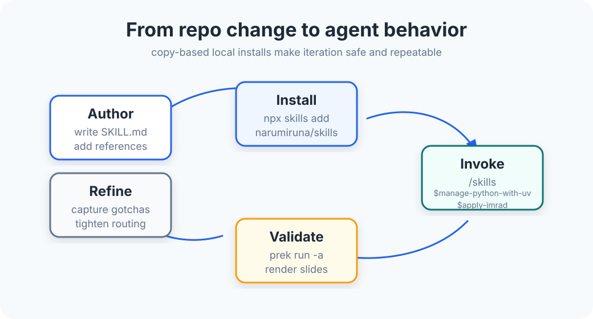

<style>
section {
  font-family: Inter, ui-sans-serif, system-ui, -apple-system, BlinkMacSystemFont, "Segoe UI", sans-serif;
  padding: 64px;
  background: #F7FAFC;
  color: #1F2937;
}
section.lead {
  text-align: left;
  display: flex;
  flex-direction: column;
  justify-content: center;
}
h1 {
  color: #2563EB;
  font-size: 56px;
  line-height: 1.05;
  font-weight: 800;
  letter-spacing: -0.03em;
}
h2 {
  color: #2563EB;
  font-size: 42px;
  line-height: 1.12;
  font-weight: 760;
  letter-spacing: -0.02em;
}
h3 {
  color: #0F766E;
  font-size: 27px;
  font-weight: 720;
}
p, li {
  font-size: 27px;
  line-height: 1.35;
}
strong {
  color: #0F766E;
}
code {
  color: #1F2937;
  background: #E2E8F0;
  border-radius: 8px;
  padding: 0 0.18em;
}
pre {
  background: #FFFFFF;
  border: 2px solid #CBD5E1;
  border-radius: 16px;
  padding: 24px;
  filter: drop-shadow(0 6px 8px rgba(31, 41, 55, 0.10));
}
pre code {
  background: transparent;
  padding: 0;
  font-size: 22px;
}
table {
  width: 100%;
  border-collapse: separate;
  border-spacing: 12px;
  font-size: 22px;
}
th {
  color: #2563EB;
  font-weight: 760;
}
td, th {
  background: #FFFFFF;
  border: 2px solid #CBD5E1;
  border-radius: 16px;
  padding: 18px 20px;
  vertical-align: top;
}
blockquote {
  border-left: 8px solid #F59E0B;
  margin-left: 0;
  padding-left: 28px;
  color: #1F2937;
}
section::after {
  color: #64748B;
  font-weight: 650;
}
</style>

<!-- _class: lead -->
<!-- _paginate: false -->
<!-- _backgroundColor: #EFF6FF -->

# Reusable Agent Skills

**A compact playbook repository for making AI coding agents more predictable.**

`narumiruna/skills` · Codex-first workflows · Marp example deck

---

## The problem: prompts do not scale by themselves

- Teams repeat the same instructions across conversations.
- Good practices get buried in ad hoc chat history.
- Agents need **task-specific context**, not a giant universal prompt.
- Maintainers need a reviewable way to update agent behavior.

> This repository turns recurring know-how into small, installable skills.

---


## Project shape

**Repository contract**

- `skills/<skill-name>/SKILL.md` is the required entry point.
- Optional support files stay beside the skill: `references/`, `scripts/`, `assets/`, `agents/`.
- `README.md` explains external use and discovery.
- `AGENTS.md` keeps maintainer workflow separate.

---

## What a skill gives the agent

| Layer | Purpose | Example |
|---|---|---|
| **Routing metadata** | Decide when to load the skill | `description:` in frontmatter |
| **Core posture** | Non-negotiable behavior | preview-first cleanup, uv-first Python |
| **Workflow** | Repeatable task steps | inspect diff → boundary → commit title |
| **References** | Deeper rules on demand | Marp syntax, color strategy, CLI notes |

---

## The collection covers common jobs-to-be-done

| Area | Skills |
|---|---|
| **Python** | `manage-python-with-uv` |
| **Writing and research** | `apply-imrad`, `researching-gourmet-venues` |
| **Slides and visuals** | `create-slide-decks`, `author-marp-slides`, `design-slide-colors`, `create-svg-illustrations`, `create-mermaid-diagrams` |
| **Workflow maintenance** | `checking-cli-help`, `write-git-commits`, `write-agents-md` |

---

## Installation paths

Use the hosted collection when you just want the skills:

```shell
npx skills add narumiruna/skills
```

---

<!-- _class: lead -->
<!-- _backgroundColor: #2563EB -->
<!-- _color: #F7FAFC -->

# Design principle

Load the smallest useful instruction set, then follow links only when the task needs more detail.

---

## Why the skills stay small

- **Faster routing:** descriptions name concrete trigger conditions.
- **Lower context cost:** entry skills point to focused references.
- **Safer changes:** behavior lives in files that can be reviewed.
- **Better reuse:** supporting scripts and examples stay versioned with the skill.

This is especially visible in the slide toolkit: colors, Marp authoring, and SVG rules are separate modules.

---



## Maintainer loop

1. Author or refine a skill in `skills/<name>/`.
2. Exercise the behavior through Codex using `/skills` or `$skill-name`.
3. Validate repository changes with `prek run -a`.
4. Rebuild slide outputs after changing `examples/slides/`.

---

## Boundaries keep the repository easy to review

| File | Owns | Avoid duplicating |
|---|---|---|
| `README.md` | install flows, external positioning, skill discovery | maintainer-only process detail |
| `AGENTS.md` | contributor workflow and repo editing rules | product messaging |
| `examples/` | slide decks and visual examples | skill source text |

---

## Example: the slide skills compose cleanly

1. `design-slide-colors` defines the 7-role palette.
2. `author-marp-slides` writes valid Marpit Markdown.
3. `create-svg-illustrations` keeps diagrams consistent and validated.
4. `create-slide-decks` ties the modules together for full decks.

**Result:** one color system, one spacing rhythm, and SVG assets that embed reliably with `bg fit`.

---

<!-- _class: lead -->
<!-- _backgroundColor: #0F766E -->
<!-- _color: #F7FAFC -->

# Takeaway

Reusable skills are versioned operating procedures for agents.

They make expertise explicit, reviewable, installable, and easier to improve.

---

## Try it

```shell
npx skills add narumiruna/skills
```

Then in Codex:

```text
/skills
$manage-python-with-uv
$create-slide-decks
$write-git-commits
```

**Start with the task. Let the matching skill load the context.**
