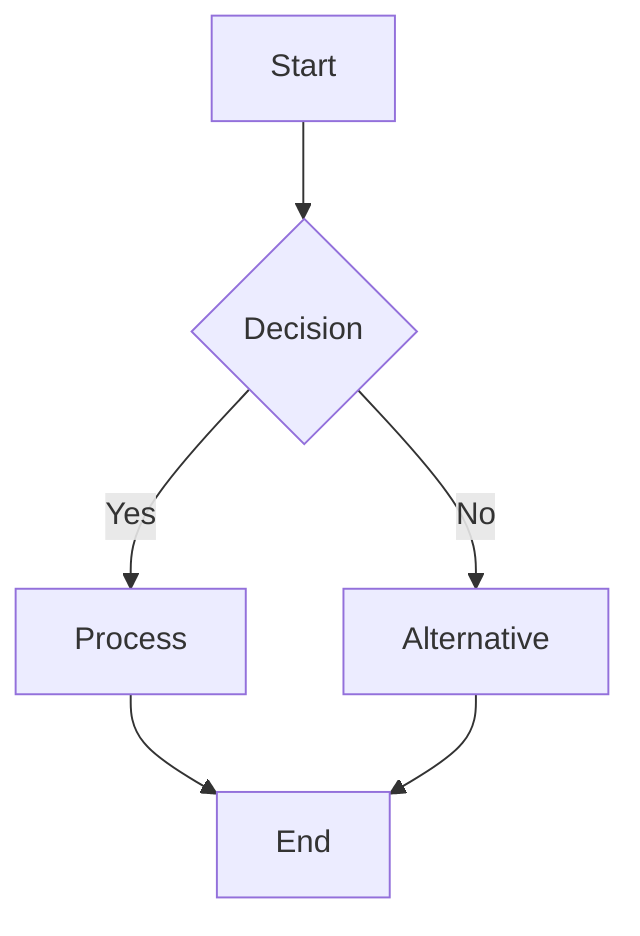
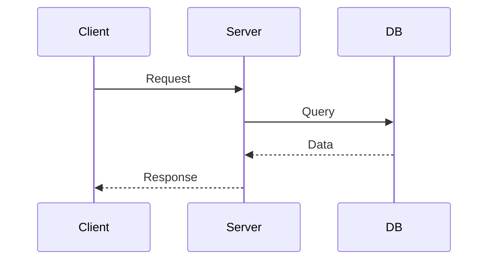
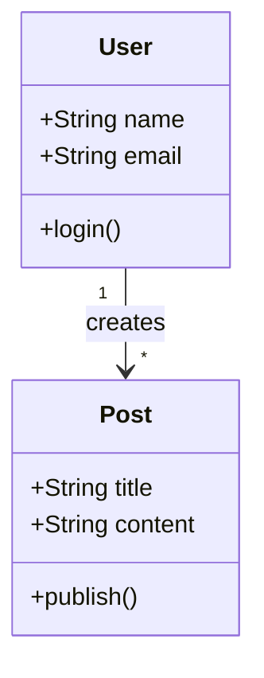
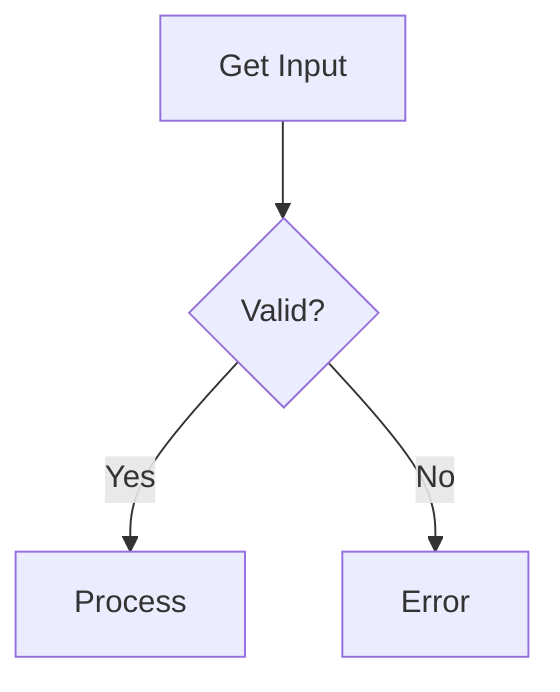
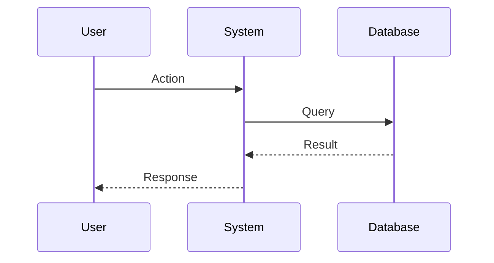

# Mermaid Creator

Create professional diagrams using Mermaid syntax for documentation, architecture design, and data modeling.

## Workflow

1. **Choose diagram type** - Select the appropriate diagram based on what needs to be visualized
2. **Create .mmd file** - Write Mermaid syntax in a `.mmd` file
3. **Validate syntax** - Check syntax is correct (Mermaid CLI will report errors)
4. **Convert to SVG** (optional) - Generate SVG for embedding in presentations or documents

## Diagram Type Selection

Choose the right diagram type for your use case:

| Type | Use Case | Reference |
|------|----------|-----------|
| **Flowchart** | Processes, workflows, decision trees | [flowchart.md](references/flowchart.md) |
| **Sequence** | API interactions, system communications, message flows | [sequence.md](references/sequence.md) |
| **Class** | Object-oriented design, data models, relationships | [class.md](references/class.md) |
| **State** | State machines, workflow states, system states | [state.md](references/state.md) |
| **ER** | Database schemas, entity relationships | [er.md](references/er.md) |
| **Gantt** | Project timelines, task scheduling | [other-types.md](references/other-types.md#gantt-charts) |
| **Pie** | Data distribution, percentages | [other-types.md](references/other-types.md#pie-charts) |
| **Git** | Git history, branching strategies | [other-types.md](references/other-types.md#git-graphs) |
| **Journey** | User experience flows | [other-types.md](references/other-types.md#user-journey) |
| **Quadrant** | 2D comparison, prioritization | [other-types.md](references/other-types.md#quadrant-chart) |
| **Timeline** | Chronological events | [other-types.md](references/other-types.md#timeline) |

**Load references as needed**: Each reference file contains syntax, patterns, examples, and best practices for that diagram type.

## Quick Start Examples

### Flowchart



### Sequence Diagram



### Class Diagram



## Example Files

The skill includes ready-to-use `.mmd` example files in `assets/examples/` that can be copied and modified:

```
assets/examples/
├── flowchart/          # 10 flowchart examples
│   ├── basic.mmd
│   ├── node-shapes.mmd
│   ├── connections.mmd
│   ├── process-flow.mmd
│   ├── decision-tree.mmd
│   └── ...
├── sequence/           # 12 sequence diagram examples
│   ├── basic.mmd
│   ├── rest-api.mmd
│   ├── authentication-flow.mmd
│   └── ...
├── class/              # 13 class diagram examples
│   ├── basic.mmd
│   ├── inheritance.mmd
│   ├── interface.mmd
│   └── ...
├── state/              # 13 state diagram examples
│   ├── basic.mmd
│   ├── order-processing.mmd
│   ├── authentication.mmd
│   └── ...
├── er/                 # 10 ER diagram examples
│   ├── basic.mmd
│   ├── blog-system.mmd
│   ├── ecommerce.mmd
│   └── ...
└── other/              # 16 other diagram type examples
    ├── gantt-basic.mmd
    ├── pie-basic.mmd
    ├── git-feature-branch.mmd
    ├── journey-shopping.mmd
    ├── quadrant-basic.mmd
    ├── timeline-basic.mmd
    └── ...
```

**Usage**: Copy example files as templates for your diagrams. All examples are tested and ready to use with the Mermaid CLI.

## Mermaid CLI

### Installation

```shell
npm install -g @mermaid-js/mermaid-cli
```

### Convert to SVG

```shell
mmdc -i diagram.mmd -o diagram.svg
```

### Batch Conversion

```shell
mmdc -i input1.mmd -i input2.mmd -o output/
```

### With Configuration

```shell
mmdc -i diagram.mmd -o diagram.svg -t dark -b transparent
```

Options:
- `-t` - Theme (default, dark, forest, neutral)
- `-b` - Background color or `transparent`
- `-w` - Width
- `-H` - Height

## Best Practices

### General Guidelines

- **Choose the right diagram type** - Match the diagram to the information structure
- **Keep it simple** - Split complex diagrams into multiple focused diagrams
- **Use descriptive labels** - Avoid abbreviations unless well-known
- **Be consistent** - Use consistent naming and styling within a diagram
- **Validate syntax** - Run through Mermaid CLI to catch errors early

### For Documentation

- Create separate `.mmd` files for each diagram
- Store diagrams near the documentation they support
- Include comments in complex diagrams using `%%` for Mermaid comments
- Generate SVG for static documentation
- Commit both `.mmd` source and generated SVG

### For Presentations

- Use high contrast colors for visibility
- Keep text large and readable
- Test diagram rendering at presentation size
- Use `transparent` background to match slide themes
- Prefer SVG over PNG for crisp rendering

### Performance

- Large diagrams (>50 nodes) may render slowly
- Split large flowcharts using off-page connectors
- For ER diagrams with many entities, show only relevant relationships
- Consider using subgraphs to organize complex diagrams

## Common Patterns

### Decision Logic

Use flowcharts with diamond decision nodes:



### System Interactions

Use sequence diagrams for temporal interactions:



### Data Models

Use ER diagrams for database schemas or class diagrams for object models.

### Process Workflows

Use state diagrams for state machines or flowcharts for process flows.

## Troubleshooting

### Syntax Errors

Run `mmdc -i file.mmd -o output.svg` to see specific error messages.

Common issues:
- Missing spaces around arrows (`A-->B` should be `A --> B` in some contexts)
- Unclosed quotes in labels
- Invalid characters in IDs (use alphanumeric + underscore)
- Wrong diagram type declaration

### Rendering Issues

- Check Mermaid CLI version: `mmdc --version`
- Update to latest: `npm install -g @mermaid-js/mermaid-cli@latest`
- Try different themes if elements overlap
- Reduce diagram complexity

### SVG Quality

- Use `mmdc -w 1920` for high-resolution output
- Set background to `transparent` for flexible embedding
- Test generated SVG in target environment

## Advanced Features

Most diagram types support:
- **Styling**: Custom colors, fonts, and borders
- **Subgraphs/Grouping**: Organize related elements
- **Notes**: Add explanatory text
- **Direction**: Change layout orientation
- **Classes**: Reusable style definitions

See individual diagram reference files for syntax and examples.
