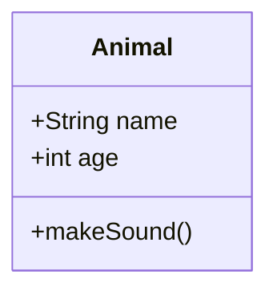

# Class Diagrams

Class diagrams represent object-oriented structures, showing classes, attributes, methods, and relationships.

## Basic Syntax

**Example**: `assets/examples/class/basic.mmd`

## Visibility

| Modifier | Symbol | Meaning |
|----------|--------|---------|
| Public | `+` | Accessible everywhere |
| Private | `-` | Class only |
| Protected | `#` | Class and subclasses |
| Package | `~` | Package/internal |

**Example**: `assets/examples/class/visibility.mmd`

## Relationships

| Type | Syntax | Meaning |
|------|--------|---------|
| Inheritance | `<|--` | Extends/inherits |
| Composition | `*--` | Strong ownership (part-of) |
| Aggregation | `o--` | Weak ownership (has-a) |
| Association | `-->` | Uses/depends on |
| Link | `--` | General connection |
| Dependency | `..>` | Temporary usage |
| Realization | `..|>` | Implements interface |

Add cardinality: `Customer "1" --> "*" Order`

**Examples**:
- `assets/examples/class/relationships.mmd`
- `assets/examples/class/cardinality.mmd`

## Common Patterns

Refer to example files for complete implementations:

- **Inheritance**: `assets/examples/class/inheritance.mmd`
  Animal base class with Dog and Cat subclasses

- **Interface Implementation**: `assets/examples/class/interface.mmd`
  Circle implementing Drawable and Resizable interfaces

- **Composition vs Aggregation**: `assets/examples/class/composition-aggregation.mmd`
  Car with Engine (composition) and Wheels (aggregation)

- **Full System**: `assets/examples/class/full-system.mmd`
  User, Post, Comment, Category relationships

## Best Practices

- Use meaningful class and attribute names
- Show only relevant attributes and methods (not every getter/setter)
- Use proper visibility modifiers
- Choose appropriate relationships (composition vs aggregation)
- Keep diagrams focused - split large systems into multiple diagrams
- Include cardinality on associations
- Group related classes visually

## Advanced Features

### Annotations

Common stereotypes: `<<interface>>`, `<<abstract>>`, `<<service>>`, `<<enumeration>>`, `<<singleton>>`

**Example**: `assets/examples/class/annotations.mmd`

### Generics

Type parameters: `List~T~`, `HashMap~K,V~`

**Example**: `assets/examples/class/generics.mmd`

### Namespaces

Group classes by namespace or module.

**Example**: `assets/examples/class/namespaces.mmd`

### Notes

Add explanatory comments: `note for ClassName "Description"`

**Example**: `assets/examples/class/notes.mmd`

### Return Types

Specify method signatures: `User findById(int id)`, `List~User~ findAll()`

**Example**: `assets/examples/class/return-types.mmd`
