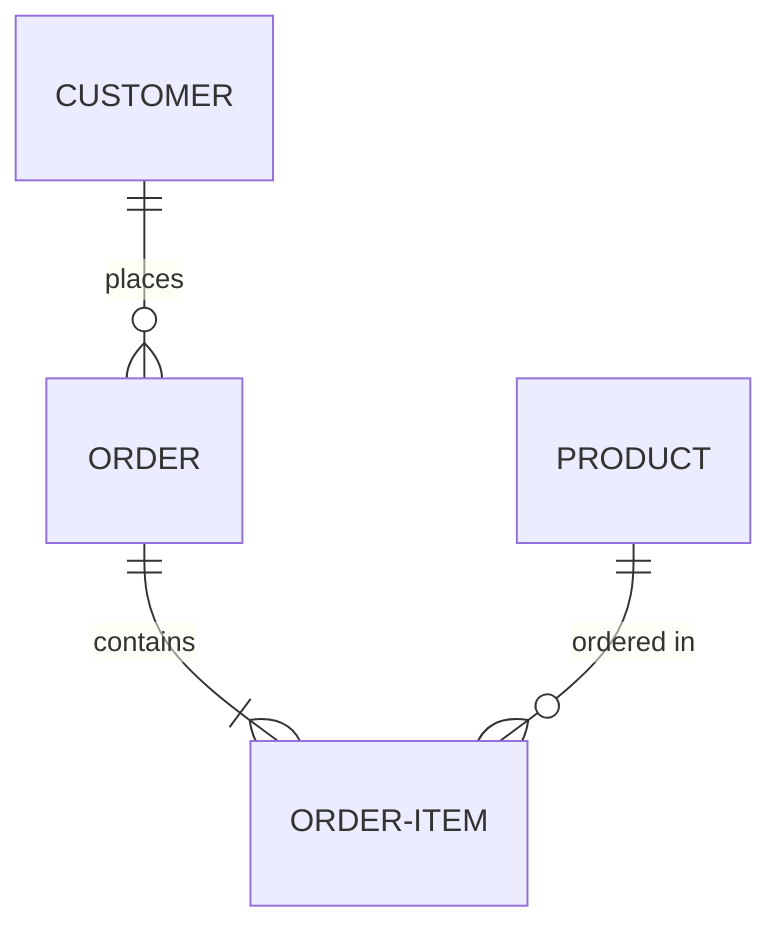
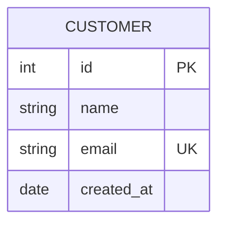

# Entity-Relationship Diagrams

ER diagrams model database schemas, showing entities, attributes, and relationships.

## Basic Syntax

**Example**: `assets/examples/er/basic.mmd`

## Entities and Attributes

Attribute annotations:
- `PK` - Primary Key
- `FK` - Foreign Key
- `UK` - Unique Key

**Example**: `assets/examples/er/entities-attributes.mmd`

## Cardinality

| Syntax | Meaning |
|--------|---------|
| `||` | Exactly one |
| `o|` | Zero or one |
| `}o` | Zero or more |
| `}|` | One or more |

Relationship notation: `LEFT RIGHT`

Examples:
- `||--||` - One to one
- `||--o{` - One to many
- `}o--o{` - Many to many
- `}|--|{` - One or more to one or more

**Example**: `assets/examples/er/cardinality.mmd`

## Common Patterns

Refer to example files for complete implementations:

- **Blog System**: `assets/examples/er/blog-system.mmd`
  User, Post, Comment, Category, Tag with many-to-many relationships

- **E-commerce**: `assets/examples/er/ecommerce.mmd`
  Customer, Order, Product, Category with self-referencing Category hierarchy

- **User Management**: `assets/examples/er/user-management.mmd`
  User, Role, Permission with join tables for many-to-many

- **Course Management**: `assets/examples/er/course-management.mmd`
  Student, Course, Instructor, Section, Enrollment

## Best Practices

- Use singular nouns for entity names (USER, not USERS)
- Use UPPERCASE for entity names
- Include primary keys (PK) for all entities
- Mark foreign keys (FK) explicitly
- Use meaningful relationship labels
- Show cardinality correctly
- Include important constraints (UK for unique keys)
- Keep attribute types clear (int, string, date, etc.)
- Don't over-complicate - focus on key relationships

## Advanced Features

### Self-Referencing

Entities that reference themselves:

**Example**: `assets/examples/er/self-referencing.mmd`
Employee manager hierarchy, Category parent-child

### Weak Entities

Entities that depend on another entity for identification:

**Example**: `assets/examples/er/weak-entities.mmd`

### Ternary Relationships

Relationships involving three entities:

**Example**: `assets/examples/er/ternary-relationships.mmd`
Doctor, Patient, Medication prescription system
