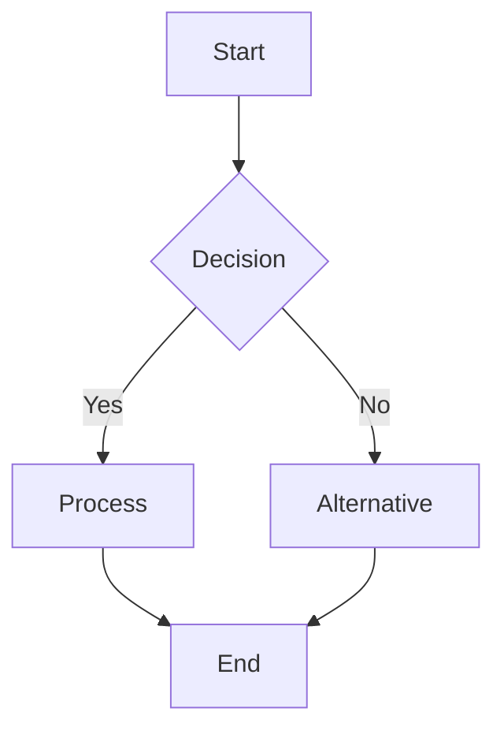
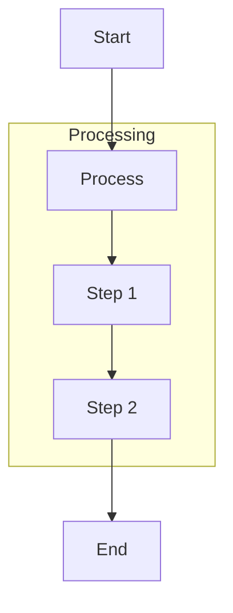

# Flowchart Diagrams

Flowcharts represent processes, workflows, and decision trees.

## Basic Syntax

**Example**: See `assets/examples/flowchart/basic.mmd`

## Direction

- `TD` or `TB` - Top to bottom
- `BT` - Bottom to top
- `LR` - Left to right
- `RL` - Right to left

## Node Shapes

| Shape | Syntax | Use Case |
|-------|--------|----------|
| Rectangle | `[Text]` | Standard process |
| Rounded | `(Text)` | Start/end points |
| Stadium | `([Text])` | Alternative start/end |
| Subroutine | `[[Text]]` | Predefined process |
| Database | `[(Text)]` | Data storage |
| Circle | `((Text))` | Connection point |
| Diamond | `{Text}` | Decision |
| Hexagon | `{{Text}}` | Preparation |
| Parallelogram | `[/Text/]` or `[\Text\]` | Input/output |
| Trapezoid | `[/Text\]` or `[\Text/]` | Manual operation |

**Example**: See `assets/examples/flowchart/node-shapes.mmd`

## Connections

| Type | Syntax | Use Case |
|------|--------|----------|
| Arrow | `-->` | Standard flow |
| Line | `---` | Connection without direction |
| Dotted arrow | `-.->` | Optional or conditional |
| Dotted line | `-.-` | Weak connection |
| Thick arrow | `==>` | Primary/important flow |
| Thick line | `===` | Strong connection |

Add labels: `A -->|Label| B`

**Examples**:
- `assets/examples/flowchart/connections.mmd`
- `assets/examples/flowchart/labeled-links.mmd`

## Common Patterns

Refer to example files for complete implementations:

- **Process Flow**: `assets/examples/flowchart/process-flow.mmd`
  Standard input → validate → process → save pattern

- **Decision Tree**: `assets/examples/flowchart/decision-tree.mmd`
  Authentication and role-based routing

- **Workflow with Subprocesses**: `assets/examples/flowchart/workflow-subprocess.mmd`
  Order processing with validation and payment

## Best Practices

- Use descriptive labels for nodes and connections
- Keep flows top-to-bottom or left-to-right for readability
- Use consistent node shapes (rectangles for processes, diamonds for decisions)
- Limit complexity - split large flows into multiple diagrams
- Use subgraphs for logical grouping

## Advanced Features

### Subgraphs

Group related processes:

**Example**: `assets/examples/flowchart/subgraph.mmd`

### Styling

Apply custom styles with `style` directive or `classDef`:

**Examples**:
- `assets/examples/flowchart/styling.mmd`
- `assets/examples/flowchart/class-definitions.mmd`
