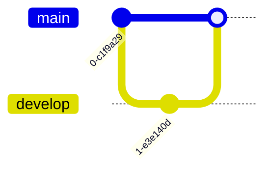

# Other Diagram Types

Additional Mermaid diagram types for specialized use cases.

## Gantt Charts

Project timelines and task scheduling.

### Basic Syntax

### Task Status

- `done` - Completed task
- `active` - In progress
- `crit` - Critical task
- No keyword - Planned task

**Examples**:
- `assets/examples/other/gantt-basic.mmd`
- `assets/examples/other/gantt-status.mmd`

## Pie Charts

Data distribution visualization.

Use `showData` to display percentages.

**Examples**:
- `assets/examples/other/pie-basic.mmd`
- `assets/examples/other/pie-showdata.mmd`

## Git Graphs

Git commit history and branching.

Add IDs and tags: `commit id: "Initial"`, `merge develop tag: "v1.0"`

**Examples**:
- `assets/examples/other/git-basic.mmd`
- `assets/examples/other/git-feature-branch.mmd`
- `assets/examples/other/git-tags.mmd`

## User Journey

User experience and interaction flows with satisfaction scores (1-5).

**Examples**:
- `assets/examples/other/journey-shopping.mmd`
- `assets/examples/other/journey-service.mmd`

## Quadrant Chart

2D comparison and categorization.

**Examples**:
- `assets/examples/other/quadrant-basic.mmd`
- `assets/examples/other/quadrant-priority.mmd`

## Timeline

Chronological events.

Use `section` for grouping.

**Examples**:
- `assets/examples/other/timeline-basic.mmd`
- `assets/examples/other/timeline-project.mmd`

## Mindmap

Hierarchical idea organization.

**Example**: `assets/examples/other/mindmap-basic.mmd`

## Requirement Diagram

Requirements and their relationships.

**Example**: `assets/examples/other/requirement-basic.mmd`

## C4 Diagram

Software architecture context.

**Example**: `assets/examples/other/c4-context.mmd`

## Best Practices by Type

### Gantt
- Use realistic date formats
- Mark critical path with `crit`
- Group related tasks in sections
- Use `after` for dependencies

### Pie
- Keep to 5-7 slices maximum
- Combine small slices into "Other"
- Use `showData` for transparency

### Git
- Use meaningful commit IDs
- Tag important releases
- Show realistic branch patterns

### Journey
- Keep to 3-5 sections
- Use consistent actor names
- Score from user perspective (1=worst, 5=best)

### Quadrant
- Choose meaningful axis labels
- Use all four quadrants
- Place items thoughtfully

### Timeline
- Group by logical periods
- Use sections for organization
- Keep descriptions concise
