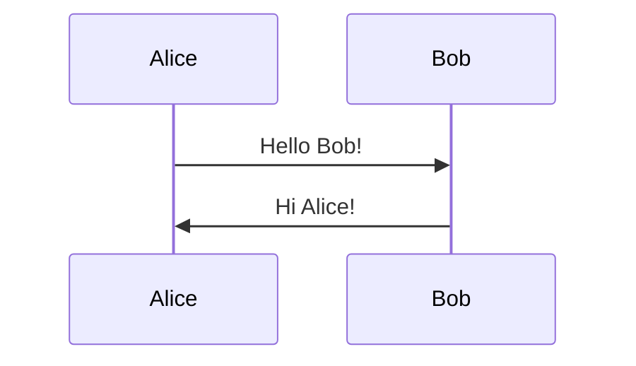
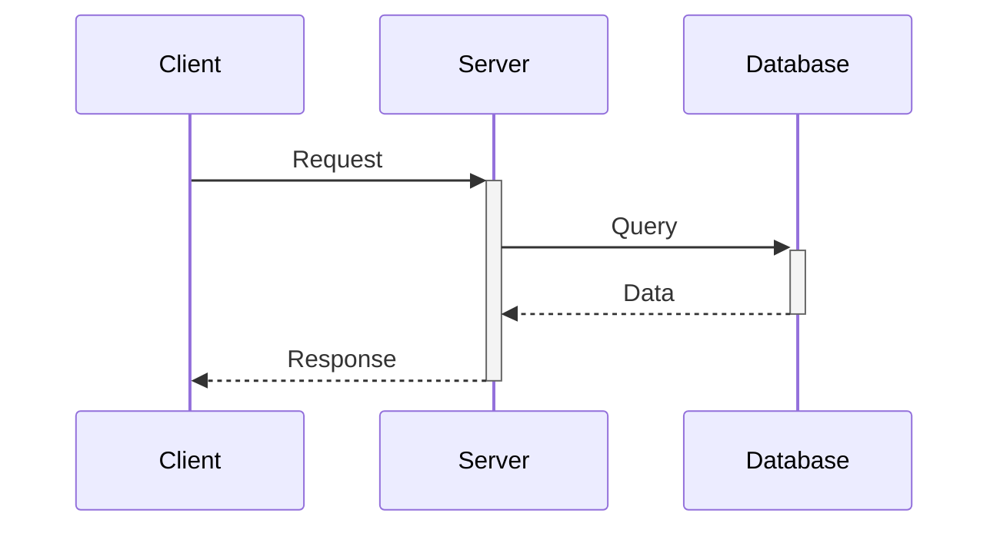
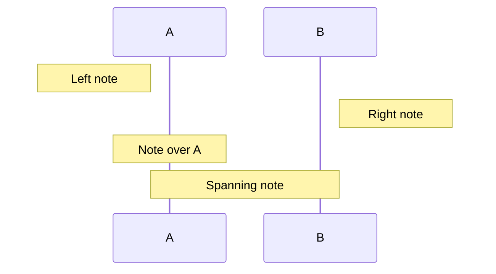

# Sequence Diagrams

Sequence diagrams show interactions between actors and systems over time.

## Basic Syntax

**Example**: `assets/examples/sequence/basic.mmd`

## Participants

- `participant` - For systems and components
- `actor` - For human users (shown with stick figure icon)

**Example**: `assets/examples/sequence/participants.mmd`

## Message Types

| Type | Syntax | Use Case |
|------|--------|----------|
| Solid arrow | `->>` | Synchronous request |
| Dotted arrow | `-->>` | Response/return |
| Async solid | `-)` | Asynchronous message |
| Async dotted | `--)` | Async response |
| Solid with X | `-x` | Lost/failed message |
| Dotted with X | `--x` | Failed response |

**Example**: `assets/examples/sequence/message-types.mmd`

## Activations

Use `+` to activate, `-` to deactivate:

**Example**: `assets/examples/sequence/activations.mmd`

## Notes

**Example**: `assets/examples/sequence/notes.mmd`

## Control Flow

| Structure | Purpose |
|-----------|---------|
| `loop` | Repeated actions |
| `alt` / `else` | Conditional branches |
| `opt` | Optional flow |
| `par` | Parallel actions |
| `critical` / `option` | Critical regions with alternatives |

**Example**: `assets/examples/sequence/loops-conditionals.mmd`

## Common Patterns

Refer to example files for complete implementations:

- **REST API Call**: `assets/examples/sequence/rest-api.mmd`
  Complete login and data fetch flow with token authentication

- **Authentication Flow**: `assets/examples/sequence/authentication-flow.mmd`
  OAuth/authorization code flow with multiple participants

- **Error Handling**: `assets/examples/sequence/error-handling.mmd`
  Success and error scenarios with alt/else blocks

## Best Practices

- Use clear participant names (User, API, Database - not A, B, C)
- Show activation bars for long-running operations
- Use notes to explain complex logic
- Keep sequences focused - split complex flows into multiple diagrams
- Use `actor` for human users, `participant` for systems
- Label messages with meaningful descriptions
- Show both request and response messages

## Advanced Features

### Autonumber

Automatically number messages:

**Example**: `assets/examples/sequence/autonumber.mmd`

### Background Colors

Highlight regions with `rect`:

**Example**: `assets/examples/sequence/background-colors.mmd`

### Critical Regions

Mark critical sections:

**Example**: `assets/examples/sequence/critical-region.mmd`
