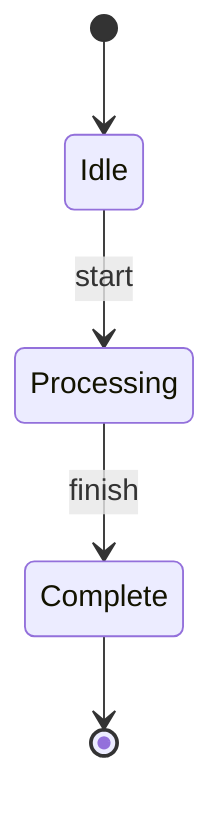
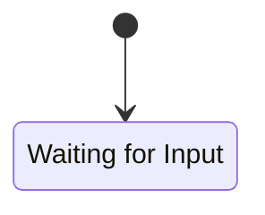
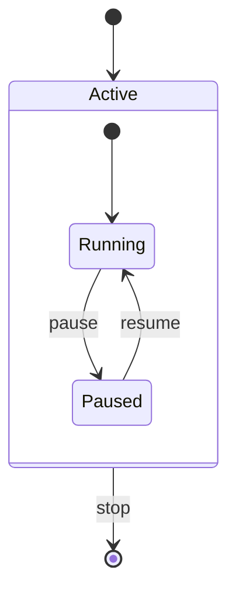
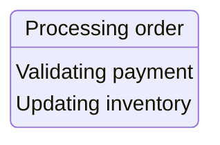

# State Diagrams

State diagrams model the states of a system and transitions between them.

## Basic Syntax



Use `[*]` for initial and final states.

**Example**: `assets/examples/state/basic.mmd`

## States

Define named states:



**Example**: `assets/examples/state/states.mmd`

## Composite States

Nest states within other states:



**Example**: `assets/examples/state/composite-states.mmd`

## Special States

| Type | Syntax | Use Case |
|------|--------|----------|
| Choice | `<<choice>>` | Conditional branching |
| Fork | `<<fork>>` | Split into parallel states |
| Join | `<<join>>` | Merge parallel states |

**Examples**:
- Choice: `assets/examples/state/choice.mmd`
- Fork/Join: `assets/examples/state/fork-join.mmd`

## Common Patterns

Refer to example files for complete implementations:

- **Simple State Machine**: `assets/examples/state/simple-state-machine.mmd`
  On/Off/Standby with power and timeout transitions

- **Order Processing**: `assets/examples/state/order-processing.mmd`
  Pending → Confirmed → Processing → Shipped → Delivered

- **Authentication**: `assets/examples/state/authentication.mmd`
  Login flow with MFA validation in composite state

- **Document Workflow**: `assets/examples/state/document-workflow.mmd`
  Draft → Review → Approved/Rejected → Published

## Best Practices

- Start with `[*]` for initial state
- End with `[*]` for final state
- Use descriptive state names
- Label all transitions clearly
- Use composite states for complex subsystems
- Use choice states for conditional branching
- Keep diagrams focused on one workflow
- Use fork/join for parallel operations

## Advanced Features

### State Descriptions

Add details to states:



**Example**: `assets/examples/state/descriptions.mmd`

### Notes

Add explanatory notes:

```mermaid
stateDiagram-v2
    note right of Active
        This is the main
        operational state
    end note
```

**Example**: `assets/examples/state/notes.mmd`

### Concurrency

Parallel regions within a state (use `--` separator):

**Example**: `assets/examples/state/concurrency.mmd`

### Complex Example

**Example**: `assets/examples/state/complex.mmd`
Demonstrates composite states, error handling, and state hierarchies.
