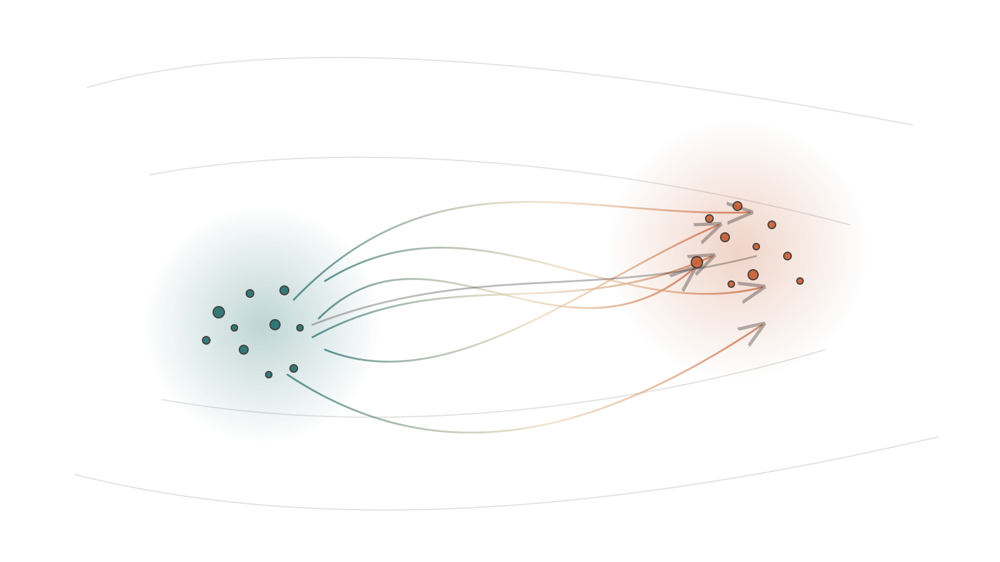

<!-- _class: lead -->

# Mean Flows
**Structure-preserving dynamics for probability transport**

Researcher-level overview

---

# Agenda

<!-- _class: tight -->

1. Motivation and intuition
2. Formal setup and equations
3. Learning objectives and theory
4. Algorithms and parameterizations
5. Applications and open problems

---

<!-- _class: lead -->

# MeanFlow (2025) paper

Average-velocity training for one-step generation <https://arxiv.org/abs/2505.13447>

---

# MeanFlow paper highlights

- **Title:** Mean Flows for One-step Generative Modeling (arXiv:2505.13447)
- **Authors:** Zhengyang Geng, Mingyang Deng, Xingjian Bai, J. Zico Kolter, Kaiming He
- **Core idea:** learn an *average velocity* field linked to instantaneous velocity
- **Claim:** self-contained training (no distillation or curriculum)
- **Result:** FID 3.43 with 1-NFE on ImageNet 256x256 (from scratch)
- **DOI:** 10.48550/arXiv.2505.13447

---

<!-- _class: lead -->

# Motivation

From static densities to **dynamical transport**

---

# Why “average velocity”?

- **Goal:** high-quality samples with **1 function evaluation** (1-NFE / one-step)
- Standard flow matching targets **instantaneous** velocity $v(z_t, t)$, but training wants interval-level consistency
- MeanFlow trains an **interval-averaged** field $u(z_t, r, t)$ so “one big step” is well-defined

---

# Notation (minimal)

- Time: $t \in [0,1]$, pick an interval $0 \le r < t \le 1$
- Endpoints: $x_0 \sim p_0$ (e.g., noise), $x_1 \sim p_1$ (e.g., data)
- Bridge (example): $z_t = (1-t)\,x_0 + t\,x_1$ (paper uses a path; linear is a common choice)
- Instantaneous velocity target: $v(z_t, t)$ (from flow matching setup)

---

# Mean flow viewpoint

- Flow Matching models an **instantaneous velocity** $v(z_t, t)$ along a path
- MeanFlow introduces an **average velocity** $u(z_t, r, t)$ over an interval
- Boundary: $\lim_{r \to t} u(z_t, r, t) = v(z_t, t)$
- Consistency comes from integral additivity across sub-intervals

---

# Average velocity definition

**Definition:**

$$
u(z_t, r, t) = \frac{1}{t-r}\int_r^t v(z_\tau, \tau)\, d\tau
$$

**MeanFlow identity (from differentiating the definition):**

$$
u(z_t, r, t) = v(z_t, t) - (t-r)\,\frac{d}{dt}u(z_t, r, t)
$$

---

# MeanFlow training objective

**Loss:**

$$
\mathcal{L}(\theta) = \mathbb{E}\,\|u_\theta(z_t, r, t) - \mathrm{sg}(u_{\text{tgt}})\|_2^2
$$

**Target from the identity:**

$$
u_{\text{tgt}} = v(z_t, t) - (t-r)\big(v(z_t, t)\,\partial_z u_\theta + \partial_t u_\theta\big)
$$

The total derivative is computed via a **JVP**.

---

# Connections

- **Flow Matching:** MeanFlow replaces instantaneous velocity targets with average velocity
- **Consistency Models:** consistency is implied by the average-velocity definition
- **Few-step diffusion/flow:** focuses on 1-NFE generation without distillation
- **CFG:** can be integrated into the target field at training time

---

# Algorithm sketch

1. Sample endpoints $(x_0, x_1)$ and times $r < t$
2. Form $z_t$ on the path and compute the instantaneous target $v(z_t, t)$ (Flow Matching)
3. Evaluate $u_\theta(z_t, r, t)$ and its JVP to build $u_{\text{tgt}}$
4. Minimize $\mathcal{L}(\theta)$ with stop-gradient on $u_{\text{tgt}}$
5. One-step generation uses $u_\theta(\epsilon, 0, 1)$

---

# Practical parameterizations

- **Neural field:** $u_\theta(z, r, t)$ with time-pair embeddings
- **Conditioning:** class labels or CFG scales as inputs
- **Structured:** affine or low-rank baselines for ablations
- **Control:** enforce Lipschitz or monotonicity for stability

---

# Implications

- Identity gives a **ground-truth target** for average velocity
- Consistency is inherent; no curriculum is required
- JVP is lightweight (reported ~16% training overhead in JAX)
- One-step inference avoids explicit time integration

---

# Experiments

- ImageNet $256\times256$: **FID 3.43** with 1-NFE, trained from scratch
- Outperforms prior one-step diffusion/flow baselines
- Closes much of the gap to multi-step models

---

# Open problems

- Theory for generalization and stability of average-velocity training
- Scaling to higher resolutions without large JVP overhead
- Extensions to stochastic or hybrid flow objectives
- Better targets for data-efficient one-step models

---

<!-- _class: lead -->

# Q&A

Thank you
