<!-- _class: lead -->
<!-- _paginate: false -->

# Basic Machine Learning

**An Introduction to Core Concepts**

---

## What is Machine Learning?

Machine learning is a subset of AI that enables systems to learn from data without explicit programming.

**Key Characteristics:**
- Learns patterns from data
- Improves with experience
- Makes predictions or decisions

---

## Types of Machine Learning

**Three Main Categories:**
- **Supervised**: Learn from labeled data (classification, regression)
- **Unsupervised**: Find patterns in unlabeled data (clustering, dimensionality reduction)
- **Reinforcement**: Learn through trial and error (game playing, robotics)

---

<!-- _class: lead -->

## ML Types Hierarchy

---

<!-- _class: lead -->

## The ML Workflow

---

## Key Concepts: Features & Labels

**Features (X)**
- Input variables
- Characteristics of data
- What the model learns from

**Labels (y)**
- Output variable
- What we want to predict
- Ground truth in supervised learning

---

## Key Concepts: Features & Labels

**Example:** Predicting house prices
- Features: size, location, bedrooms
- Label: price

---

## Training vs Testing

### Training Set (70-80%)
- Used to learn patterns
- Model adjusts parameters
- Sees examples with labels

### Test Set (20-30%)
- Evaluates performance
- Unseen by model
- Measures generalization

**Why split?** Avoid overfitting and ensure model works on new data

---

## Common Algorithms

| Algorithm | Type | Use Case |
|-----------|------|----------|
| Linear Regression | Supervised | Predict continuous values |
| Logistic Regression | Supervised | Binary classification |
| Decision Trees | Supervised | Classification/Regression |
| K-Means | Unsupervised | Clustering |
| Neural Networks | Supervised | Complex patterns |

---

## Model Evaluation Metrics

### Classification
- **Accuracy**: Correct predictions / Total predictions
- **Precision**: True positives / (True + False positives)
- **Recall**: True positives / (True positives + False negatives)
- **F1 Score**: Harmonic mean of precision and recall

### Regression
- **MSE** (Mean Squared Error): Average squared differences
- **RMSE** (Root MSE): Square root of MSE
- **R² Score**: Proportion of variance explained

---

<!-- _class: lead -->

## Model Evaluation Process

---

## Overfitting vs Underfitting

### Overfitting
- Model too complex
- Memorizes training data
- Poor test performance

**Solution:**
- More data
- Regularization
- Simpler model

### Underfitting
- Model too simple
- Misses patterns
- Poor train & test performance

**Solution:**
- More features
- Complex model
- Better features

---

## Feature Engineering

Transform raw data into meaningful features

**Techniques:**
- **Scaling**: Normalize values (0-1 or standardize)
- **Encoding**: Convert categorical to numerical
- **Creation**: Combine features (e.g., age from birthdate)
- **Selection**: Remove irrelevant features

**Impact:** Good features = Better model performance

---

## Neural Networks Basics

**Components:**
- **Neurons**: Process and transform inputs
- **Weights**: Connection strengths (learned)
- **Activation**: Non-linear transformations
- **Backpropagation**: Learning algorithm

---

<!-- _class: lead -->

## Neural Network Architecture

---

## Deep Learning

Neural networks with multiple hidden layers

**Applications:**
- **Computer Vision**: Image classification, object detection
- **Natural Language**: Translation, text generation
- **Speech**: Recognition, synthesis
- **Recommendation**: Personalized content

**Requirements:**
- Large datasets
- Significant compute power
- Careful architecture design

---

## Best Practices

✓ **Start simple** - Baseline before complexity
✓ **Validate properly** - Use cross-validation
✓ **Monitor metrics** - Track train/test performance
✓ **Feature quality** - Better data > complex models
✓ **Document** - Record experiments and results
✓ **Iterate** - Continuous improvement

---

## Common Pitfalls

⚠ **Data leakage** - Test data influences training
⚠ **Class imbalance** - Unequal label distribution
⚠ **Correlation ≠ Causation** - Don't assume causality
⚠ **Ignoring bias** - Model reflects data biases
⚠ **No baseline** - Need comparison point

---

<!-- _class: lead -->

# Next Steps

1. Practice with real datasets (Kaggle, UCI ML Repository)
2. Learn a framework (scikit-learn, TensorFlow, PyTorch)
3. Work on projects that interest you
4. Join ML communities and competitions

**Resources:** Coursera, fast.ai, Andrew Ng's courses

---

<!-- _class: lead -->
<!-- _paginate: false -->

# Questions?

**Thank you for your attention**
