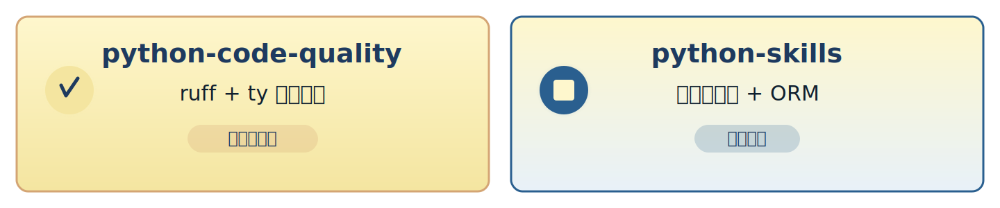

<!-- _class: lead -->
<!-- _backgroundColor: #0f1f2e -->
<!-- _color: #fef7cd -->

# 🔌 Narumi's Claude Marketplace

**Claude Code 插件市場**
打造現代化 Python 開發環境

---

<!-- _class: lead -->

## 為什麼需要插件市場？

**統一管理、快速部署、持續改進**

提升開發效率的最佳實踐

---

## 🎯 核心價值

<div style="display:grid; grid-template-columns: repeat(3, 1fr); gap:48px; margin-top:32px;">

<div style="text-align:center; background: #0f1f2e; padding: 32px; border-radius: 16px; border: 3px solid #4a7ba7;">

### ⚡ 自動化

自動執行程式碼檢查
零配置即可使用

</div>

<div style="text-align:center; background: #0f1f2e; padding: 32px; border-radius: 16px; border: 3px solid #4a7ba7;">

### 📚 標準化

統一開發工具與流程
團隊協作更順暢

</div>

<div style="text-align:center; background: #0f1f2e; padding: 32px; border-radius: 16px; border: 3px solid #4a7ba7;">

### 🔧 可擴展

輕鬆添加新技能
自定義工作流程

</div>

</div>

---

<!-- _class: lead -->
<!-- _backgroundColor: #0f1f2e -->
<!-- _color: #fef7cd -->

# 兩大核心插件

**Code Quality + Development Skills**

---

## 📦 插件總覽



---

## 🛡️ python-code-quality

**自動化程式碼品質檢查**

<div style="background: #0f1f2e; padding: 32px; border-radius: 16px; border-left: 6px solid #f4e5a0;">

### 功能特色

- **ruff format** - 自動格式化
- **ruff check --fix** - 智慧修復
- **ty check** - 型別檢查

### 執行時機

在 Edit/Write 操作前自動執行

</div>

---

## 🛡️ python-code-quality

<div style="margin-top:32px; background: #0f1f2e; padding: 32px; border-radius: 16px; border: 3px solid #4a7ba7;">

### 技術架構

**Hooks Plugin** (PreToolUse)

- 攔截檔案操作
- 自動執行檢查
- 確保程式碼品質

### 零配置啟用

安裝即可使用，無需額外設定

</div>

---

## 🎓 python-skills

**完整 Python 開發技能包**

### 包含兩大技能模組

<div style="margin-top:32px; background: #0f1f2e; padding: 32px; border-radius: 16px; border: 3px solid #4a7ba7;">

**1. Python Project Workflow** (`python-project`)
- 現代工具鏈: uv, ruff, pytest, ty
- CLI 開發: typer
- 日誌系統: loguru

**2. Peewee ORM Patterns** (`python-peewee`)
- DatabaseProxy 設定模式
- 連線管理與交易處理
- SQLite 測試範例

</div>

---

<!-- _class: lead -->
<!-- _backgroundColor: #0f1f2e -->
<!-- _color: #fef7cd -->

# 快速開始

**三步驟完成安裝**

---

## 🚀 安裝步驟


---

## 步驟 1: 新增市場

從 GitHub 安裝：

```bash
/plugin marketplace add narumi/claude-marketplace
```

本地測試：

```bash
/plugin marketplace add ./path/to/claude-marketplace
```

---

## 步驟 2: 安裝插件

**安裝程式碼品質檢查**

```bash
/plugin install python-code-quality@narumi
```

**安裝 Python 開發技能**

```bash
/plugin install python-skills@narumi
```

---

## 步驟 3: 開始使用

插件安裝後自動啟用

<div style="margin-top:32px; background: #0f1f2e; padding: 32px; border-radius: 16px; border: 3px solid #f4e5a0;">

### 🎯 立即體驗

- 編輯 Python 檔案 → 自動格式化 ✓
- 程式碼檢查 → 自動修復問題 ✓
- 型別檢查 → 即時回饋 ✓

### 📖 獲取幫助

Claude 自動獲得 Python 開發最佳實踐知識

</div>

---

<!-- _class: lead -->
<!-- _backgroundColor: #0f1f2e -->
<!-- _color: #fef7cd -->

# 進階功能

**測試與自訂**

---

## 🧪 測試與驗證

**確保市場結構正確**

```bash
/plugin validate .
```

**本地測試工作流程**

```bash
# 1. 新增本地市場
/plugin marketplace add .

# 2. 列出可用插件
/plugin list

# 3. 測試安裝
/plugin install python-skills@narumi
```

---

## 🛠️ 自訂與擴展

<div style="display:grid; grid-template-columns: 1fr 1fr; gap:48px; margin-top:32px;">

<div style="background: #0f1f2e; padding: 32px; border-radius: 16px; border-left: 6px solid #d4a574;">

### 建立自己的插件

- 參考 `GUIDE.md` 完整指南
- 使用 `strict: false` 模式
- 組織技能檔案於 `skills/` 目錄

</div>

<div style="background: #0f1f2e; padding: 32px; border-radius: 16px; border-left: 6px solid #d4a574;">

### Multi-skill 插件

`python-skills` 示範多技能整合

### Hooks 插件範例

`python-code-quality` 展示工具攔截

</div>

</div>

---

## 📂 目錄結構

**Marketplace 標準組織**

```
marketplace/
├── plugins/
│   ├── python-code-quality/
│   └── python-skills/
└── skills/
    ├── python-project/
    └── python-peewee/
```

<div style="margin-top:32px; background: #0f1f2e; padding: 24px; border-radius: 12px; border-left: 6px solid #4a7ba7;">

**關鍵原則**

- 插件定義於 `plugins/` 目錄
- 共享技能於 `skills/` 目錄
- 每個插件獨立配置

</div>

---

## 📚 文檔資源

<div style="margin-top:32px;">

<div style="background: #0f1f2e; padding: 32px; border-radius: 16px; border: 3px solid #f4e5a0; margin-bottom: 32px;">

### 核心文檔

- **[GUIDE.md](GUIDE.md)** - 建立市場完整指南
- **[CLAUDE.md](CLAUDE.md)** - 開發者指南
- **[README.md](README.md)** - 快速入門

</div>

<div style="background: #0f1f2e; padding: 32px; border-radius: 16px; border: 3px solid #4a7ba7;">

### 範例展示

- Hooks 插件實作
- 多技能插件組織
- Marketplace 驗證流程

</div>

</div>

---

<!-- _class: lead -->
<!-- _backgroundColor: #0f1f2e -->
<!-- _color: #fef7cd -->

# 開始使用

**提升你的 Python 開發體驗**

```bash
/plugin marketplace add narumi/claude-marketplace
/plugin install python-code-quality@narumi
/plugin install python-skills@narumi
```

**GitHub**: narumi/claude-marketplace
